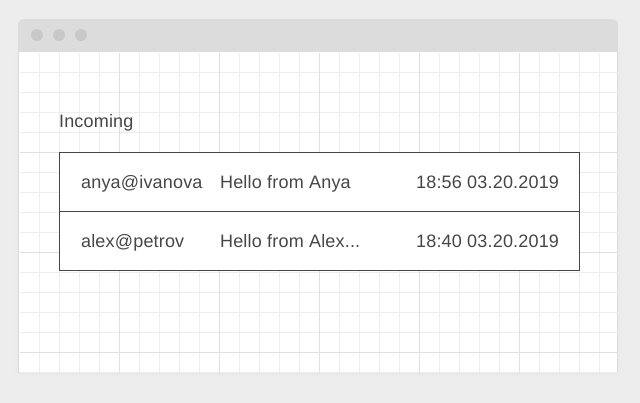

#### Домашние задания к курсу «Продвинутый JavaScript в браузере»
### 11. RXJS - Задание #1. Polling

[](https://ci.appveyor.com/project/npeplov/ahj-rxjs-front)

Environment: https://npeplov.github.io/ahj-rxjs-front

Heroku: https://npeplov-ahj-rxjs-back.herokuapp.com/api/check-email

---

## Polling

Вы делаете корпоративную систему, в рамках которой есть система обмена сообщениями, аналогичная email. Вам необходимо реализовать периодический опрос сервера о поступлении новых сообщений. Поскольку для работы в вашей организации используестя rxjs, то и сделать вам это нужно с его помощью.

#### Серверная часть

Реализуйте простой REST endpoint `/messages/unread`, который возвращает непрочитанные сообщения. Для генерации случайных данных можете воспользоваться библиотекой [faker](https://www.npmjs.com/package/faker).

Формат выдаваемых сообщений:
```json
{
  "status": "ok",
  "timestamp": 1553400000,
  "messages": [
    {
      "id": "<uuid>",
      "from": "anya@ivanova",
      "subject": "Hello from Anya",
      "body": "Long message body here" ,
      "received": 1553108200
    }
    {
      "id": "<uuid>",
      "from": "alex@petrov",
      "subject": "Hello from Alex Petrov!",
      "body": "Long message body here",
      "received": 1553107200
    },
    ...
  ]
}
```

#### Клиентская часть

На клиенте с помощью rxjs вам нужно реализовать виджет, подписывающийся на "обновления". При получении обновлений они должны добавляться в таблицу сообщений:




Сообщения добавляются именно сверху, предыдущие не удаляются.

Для получения данных через определённые промежутки используйте оператор `interval`.

Для запросов используйте [ajax](https://rxjs-dev.firebaseapp.com/api/ajax/ajax):
```javascript
import { ajax } from 'rxjs/ajax';

ajax.getJSON(<url>);
```

Обратите внимание:
1. Сообщения лежат в свойстве `messages`
1. При отображении вам нужно сокращать `subject` до 15 символов, если длина больше, то последние название сокращается до 15 символов и дополняется символом многоточия
1. Дата при отображении переводится из timestamp в формат ЧЧ:ММ ДД.ММ.ГГГГ

При получении ошибки (сервер недоступен, либо код ответа не 200), преобразовывайте ошибку так, чтобы это было аналогично отсутствию новых сообщений.